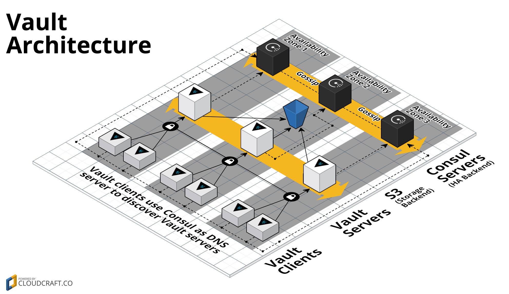

# terraformed-vault-on-aws


## Prerequisites

Install the following:
* [Terraform](https://www.terraform.io/downloads.html)
* [Packer](https://www.packer.io/downloads.html)
* [AWS CLI tool](https://aws.amazon.com/cli/)

NOTE: This guide builds upon the original Terraform Registry Module released from [HashiCorp](https://github.com/hashicorp/terraform-aws-vault) and walks through a practical example of how to deploy such an architecture on AWS using Terraform.


## Setting up a Bastion Host as SSH Proxy (Your computer -> SSH into Bastion Host -> SSH into Vault Server)

* Create a VPC and Subnet for the Bastion Host to reside in. Note down their IDs.
* Lets also export some other environment variables to connect to your AWS account from your local `aws cli` tool, including the VPC ID and the Subnet ID obtained above:
```
export VPC_ID=<redacted>
export SUBNET_ID=<redacted>
export AWS_ACCESS_KEY_ID=<redacted>
export AWS_SECRET_ACCESS_KEY=<redacted>
export AWS_SESSION_TOKEN=<redacted>
```
* Create Security Groups to allow ingress from ports `22`, `80` and `443` for all the allowed IPs.
* Note down the Security Group ID that gets created for allowing ingress on port 22. Export it as an environment variable.
```
export SECURITY_GROUP_ID=<redacted>
```
* Generate a key pair `temp` if you don't already have one.
* Start a Bastion Host:
    * Choose the Subnet that allows ingress.
    * Choose the Security Group that allows Ingress on port 22 from the allowed IP ranges. This is to mainly allow SSH in from allowed IPs onto the Bastion Host.
    * Choose the appropriate key pair, which in my case, I've named it `temp`.
* Wait for the instance to come up. Once it does, associate an elastic IP to it, which is what would be used to SSH in onto the Bastion Host. Make sure you have your `~/.ssh/config` file properly setup and SSH key properly added by `ssh-add <key>`. The SSH config file should look like below:
```
Host aws-bastion
    HostName <ip>
    Port 22
    User <user>
    IdentityFile /location/to/temp.pem
    ForwardAgent yes
    StrictHostKeyChecking no
    UserKnownHostsFile /dev/null
    ServerAliveInterval 100
```
* You should be able to successfully SSH onto the Bastion host by typing something like `ssh aws-bastion`.


## Generating TLS certs for services/applications to talk to Vault over SSL

When we don't want to expose the Vault servers publicly on the internet, we need to use the [private-tls-cert](https://github.com/anshumanbh/terraform-aws-vault/tree/master/modules/private-tls-cert) Terraform module to generate a CA certificate and public/private key pair for the Vault TLS certificate.

* Git Clone that repository. Navigate to the `private-tls-cert` module.
* Open variables.tf and modify any variables as needed or feel free to use the default one. Make sure you change the OS owner name though.
* Generate the certs via Terraform by typing:
```
terraform init
terraform plan
terraform apply
```
* Remove the `tfstate` file(s) as it may contain sensitive information and we don't want it to be hanging around - `rm -rf terraform.tfstate*`
* Verify by typing `openssl x509 -inform pem -noout -text -in vault.crt.pem`

*Note:*
Some of the variables I used are:
```
dns_names=vault.service.consul
ip_addresses=127.0.0.1
```
You can change them accordingly, if you wish to.

The output of running this Terraform module should result in the creation of 3 files in the `private-tls-cert` directory:
* Vault CA’s public certificate - ca.crt.pem
* Vault service public certificate - vault.crt.pem
* Vault service private key - vault.key.pem


## Building AMI(s) for Vault and Consul servers using Packer

Reference: [here](https://github.com/anshumanbh/terraform-aws-vault/tree/master/examples/vault-consul-ami)

* cd into the `../../examples/vault-consul-ami/` directory. Feel free to modify the values in the `vault-consul.json` file as per your needs.
* You also need a Github Token so generate a temp token and export it as an environment variable:
```
export GITHUB_OAUTH_TOKEN=<redacted>
```
* Build the AMI by typing `packer build vault-consul.json`. The `VPC_ID`, `SUBNET_ID` and `SECURITY_GROUP_ID` environment variables exported as environment variables earlier would come in handy where after starting the instances, packer would use those values to SSH from your local system onto those instances to do the installation of Vault and Consul and build the AMI(s).
* When the build finishes, you should see something like:
```
==> Builds finished. The artifacts of successful builds are:
--> amazon-linux-ami: AMIs were created:
us-west-2: <redacted>

--> ubuntu16-ami: AMIs were created:
us-west-2: <redacted>
```

NOTE: Don't forget to revoke your temp Github token.


## Deploying the Vault and Consul cluster on AWS

Now, that we have the AMI built, let's deploy a Vault and Consul cluster w/ S3 backend as depicted in the architecture:



* cd into the `../vault-s3-backend/` directory.
* Create the `terraform.tfvars` file as shown below:
    * In this file below, the `ami_id` can be any of the ones created above. We are using the `amazon-linux-ami` AMI ID here.
    * The `vpc_id` is the VPC created above.
    * `subnet_ids` are actually the IDs of Subnets in different availability zones that allow communications between Vault and Consul servers along with Egress'ing out to the internet. If you don't have such a Subnet(s), you can create one.
    * The `vault_allowed_ssh_cidr_blocks` and `consul_allowed_ssh_cidr_blocks` are both the internal IP address of the bastion because thats where you would be SSH'ing in to the Vault and Consul servers from, if needed.
    * The `vault_allowed_inbound_cidr_blocks` is the IP range for all systems that the Vault servers would allow all incoming connections from.
    * The `consul_allowed_inbound_cidr_blocks` includes the above + the CIDR blocks for the Subnets which is where the Vault Servers would be deployed. This is because Consul Servers need to allow the Vault Servers to ingress in as well.
```
cat -> terraform.tfvars <<EOF
ami_id = "<redacted>"
vpc_id = "<redacted>"
subnet_ids = ["<redacted>","<redacted>","<redacted>"]
vault_allowed_ssh_cidr_blocks = ["<redacted>"]
vault_allowed_inbound_cidr_blocks = ["<redacted>"]
consul_allowed_ssh_cidr_blocks = ["<redacted>"]
consul_allowed_inbound_cidr_blocks = ["<redacted>", "<redacted>"]
EOF
```
* Deploy it by typing:
```
terraform get
terraform init
terraform plan
terraform apply
```
* After everything finishes, the output should look like below:
```
Apply complete! Resources: 29 added, 0 changed, 0 destroyed.

Outputs:

asg_name_consul_cluster = <redacted>
asg_name_vault_cluster = <redacted>
aws_region = <redacted>
consul_cluster_cluster_tag_key = consul-vault-s3-servers
consul_cluster_cluster_tag_value = consul-s3-example
iam_role_arn_consul_cluster = <redacted>
iam_role_arn_servers = <redacted>
iam_role_arn_vault_cluster = <redacted>
iam_role_id_consul_cluster = consul-s3-example20180216004440844200000001
iam_role_id_servers = consul-s3-example20180216004440844200000001
iam_role_id_vault_cluster = vault-s3-example20180216004440844300000002
launch_config_name_consul_cluster = consul-s3-example-20180216004445560600000008
launch_config_name_servers = consul-s3-example-20180216004445560600000008
launch_config_name_vault_cluster = vault-s3-example-20180216004444990600000007
s3_bucket_arn = arn:aws:s3:::my-vault-bucket
security_group_id_consul_cluster = <redacted>
security_group_id_servers = <redacted>
security_group_id_vault_cluster = <redacted>
ssh_key_name = temp
vault_cluster_size = 3
vault_servers_cluster_tag_key = Name
vault_servers_cluster_tag_value = vault-s3-example
```


## Testing the deployment

* Now, we have the entire infrastucture up. So, let's start by SSH'ing into one of the Vault Servers via the Bastion. I added the below section to my `~/.ssh/config` section:
```
Host vault-server-1
    HostName <>
    User <user>
    Port 22
    ProxyCommand ssh -q -W %h:%p aws-bastion

Host consul-server-1
    HostName <>
    User <user>
    Port 22
    ProxyCommand ssh -q -W %h:%p aws-bastion
```
* Make sure you choose any one of the Vault Server and the Consul Server and add their private IPs above.
* SSH into the Vault Server:
```
ssh vault-server-1
```
* Initialize Vault:
```
vault init
```
The output should look like:
```
Unseal Key 1: <redacted>
Unseal Key 2: <redacted>
Unseal Key 3: <redacted>
Unseal Key 4: <redacted>
Unseal Key 5: <redacted>
Initial Root Token: <redacted>
```
* Unseal Vault:
```
vault unseal (3 times)
```
* Authenticate to the root account with the root token:
```
vault auth (root token)
```
* Write and read a secret:
```
vault write secret/example value=secret
vault read secret/example
```


## Deleting the infrastructure

* `terraform destroy`
* `rm -rf .terraform/`
* `rm terraform.tf*`